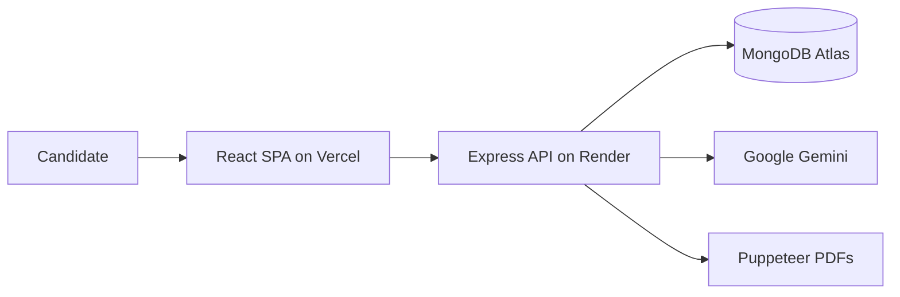

# HirePilot AI

### AI interview prep that scores you honestly — not with empty pep talk

[](https://hirepilot-frontend-mu.vercel.app)
[](https://hirepilotai-whej.onrender.com/api/health)
[](https://www.mongodb.com/atlas)
[](#license)

**Live app:** [hirepilot-frontend-mu.vercel.app](https://hirepilot-frontend-mu.vercel.app)  
**Stack:** React 19 · Vite · Express · MongoDB · Google Gemini · JWT cookies

---

## Why this exists

Most interview prep tools either give generic questions or inflate your score so you feel good.  
**HirePilot AI** is built for the opposite: upload a resume, paste a real job description, and get a **role-specific plan + scored practice** that tells you where you actually stand.

I built this as a full-stack MERN product end-to-end — auth, AI workflows, practice sessions, admin tooling, and production deploy (Vercel + Render + Atlas).

---

## What you can do

| Flow | What happens |
|------|----------------|
| **Interview plan** | Resume + JD → match score, strengths, skill gaps, tech/behavioral questions, 5-day prep roadmap, PDF export |
| **Scored practice** | Live mock interview — every answer graded on **relevance, depth, structure, clarity, specificity** |
| **Adaptive follow-ups** | Weak/vague answers get probed on the next turn (not a fixed quiz list) |
| **Auth** | Register / login with **email OTP**, forgot-password OTP, JWT access + rotating refresh cookies |
| **Profile & history** | Resume on profile, past plans, past practice reports |
| **Admin** | Users, interviews, AI usage, feature flags, feedback, audit log |

> **Coming soon (not shipped yet):** camera-based mock interviews that analyze expression, gesture, posture, and confidence. Today’s practice is **text-based scored interviews only**.

---

## Demo

| | |
|---|---|
| **Frontend** | https://hirepilot-frontend-mu.vercel.app |
| **API health** | https://hirepilotai-whej.onrender.com/api/health |

> Render free tier may cold-start (~30–60s) after idle time. If login/register fails once, wait a minute and retry.

**Try this path:** Register → New interview plan (paste any JD + resume PDF) → open Practice → answer 3–6 questions → read the report.

---

## Product walkthrough

```text
1. Paste target job description + upload resume (PDF)
2. Gemini generates a structured interview plan
3. Start a practice session (technical / behavioral / mixed)
4. Answer → get rubric score + feedback → next question
5. End with overall score, weakest dimension, and transcript
```



---

## Tech stack

### Frontend
- **React 19** + **Vite 7**
- **React Router 7**
- **SCSS** design tokens / component system
- **Axios** with cookie credentials + silent token refresh

### Backend
- **Node.js** + **Express 5**
- **MongoDB** + **Mongoose**
- **JWT** httpOnly cookies (`access` + rotating `refresh`)
- **Google Gemini** (`@google/genai`) structured JSON via Zod schemas
- **Multer** + **pdf-parse** for resume upload
- **Puppeteer** for resume/report PDFs
- **Helmet**, **CORS**, **rate limiting**, central error middleware

### Deploy
- Frontend → **Vercel**
- Backend → **Render**
- Database → **MongoDB Atlas**

---

## Engineering highlights (recruiter-facing)

Things I cared about beyond “it works on my machine”:

- **Cross-origin auth** — Vercel ↔ Render cookies with `SameSite=None; Secure`, explicit CORS allowlist (not `origin: true`)
- **AI reliability** — structured outputs validated with Zod; retries for transient 503/429; quota errors fail fast
- **Latency-aware AI UX** — interview plan split into **parallel** Gemini calls; practice returns **score first**, next question prefetches while you read feedback
- **Honest product copy** — no fake contact emails, no selectable “Coming Soon” paid plans
- **Admin observability** — AI token usage logging, audit log, feature flags
- **Security basics** — bcrypt passwords, httpOnly cookies, token blacklist on logout, rate limits on auth routes

---

## Project structure

```text
HirePilotAI/
├── Frontend/                 # React + Vite SPA
│   ├── src/
│   │   ├── features/         # auth, interview, practice, profile, admin
│   │   ├── components/       # shared UI + layout
│   │   ├── pages/            # landing + marketing
│   │   └── lib/              # apiClient, etc.
│   └── vercel.json
├── Backend/                  # Express API
│   ├── src/
│   │   ├── controllers/
│   │   ├── models/
│   │   ├── routes/
│   │   ├── services/         # Gemini + PDF
│   │   ├── middlewares/
│   │   └── config/
│   └── server.js
├── DEPLOYMENT.md             # Production setup notes
└── README.md
```

---

## Local setup

### Prerequisites
- Node.js 18+
- MongoDB (local or Atlas)
- Google Gemini API key

### 1. Backend

```bash
cd Backend
cp .env.example .env   # if present — or create .env with the vars below
npm install
npm run dev
```

**Required env**

```env
MONGO_URI=your_mongodb_uri
JWT_SECRET=a_long_random_string
GOOGLE_GENAI_API_KEY=your_gemini_key
FRONTEND_URL=http://localhost:5173
PORT=3000
NODE_ENV=development
```

Optional SMTP vars: if unset, OTP / verification emails are logged in the console (fine for local).

### 2. Frontend

```bash
cd Frontend
cp .env.example .env
# VITE_API_URL=http://localhost:3000
npm install
npm run dev
```

Open **http://localhost:5173** (prefer `localhost` over `127.0.0.1` so CORS matches).

### 3. Admin user (optional)

```bash
cd Backend
npm run create-admin -- --email you@example.com --username you --password "StrongPass123"
```

---

## Production deploy (short version)

Full checklist: [`DEPLOYMENT.md`](./DEPLOYMENT.md)

| Piece | Platform | Key env |
|-------|----------|---------|
| API | Render | `MONGO_URI`, `JWT_SECRET`, `GOOGLE_GENAI_API_KEY`, `FRONTEND_URL`, `NODE_ENV=production` |
| SPA | Vercel | `VITE_API_URL` = backend URL (set at **build** time) |
| DB | Atlas | Network access for Render |

`FRONTEND_URL` must match the Vercel origin exactly (**no trailing slash**), or browsers will block auth as a “network error”.

---

## API surface (high level)

| Area | Examples |
|------|----------|
| Auth | `/api/auth/register`, `/login`, `/verify-login-otp`, `/forgot-password`, `/refresh-token` |
| Interview plans | `/api/interview/` (multipart resume + JD) |
| Practice | `/api/session`, `/api/session/:id/answer`, `/complete` |
| Profile / admin / feedback | `/api/profile`, `/api/admin/*`, `/api/feedback` |
| Health | `GET /api/health` |

---

## Roadmap

- [x] Resume + JD → AI interview plan  
- [x] Scored text mock interviews with adaptive follow-ups  
- [x] OTP login / password reset (email; local preview when SMTP unset)  
- [x] PDF exports, admin panel, marketing pages  
- [ ] Camera / voice mock interviews (expression, posture, confidence) — **planned**  
- [ ] Deeper progress analytics across many sessions  

---

## Author

Built by **[Prashant Gupta](https://github.com/iprashantguptaa)**  

If you’re a recruiter or hiring manager reviewing this repo: the live demo is the fastest way to evaluate the product; this README is the map of what’s real vs planned.

---

## License

ISC — see package metadata. Feel free to fork for learning; please don’t rebrand the live demo as your own product without changes.
